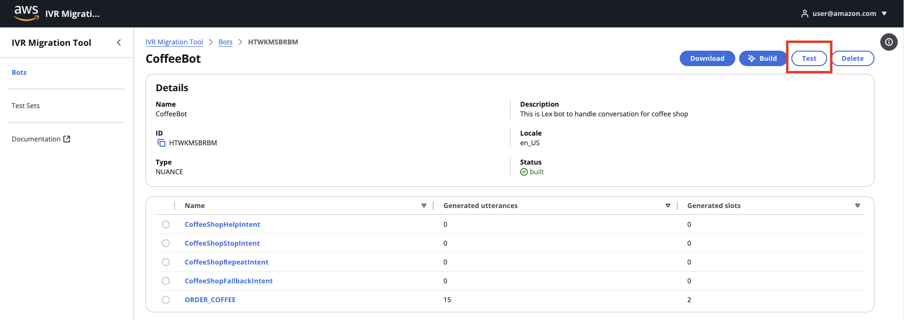
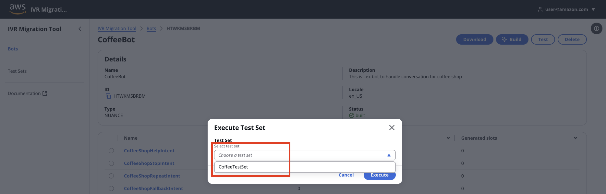

# Guidance for IVR Chatbot migration to Amazon Lex and Amazon Connect

[Amazon Connect](https://aws.amazon.com/connect/) offers flexible IVR options to meet your unique needs and timelines. We aim to provide customers with a seamless transition to [Amazon Lex](https://aws.amazon.com/lex/), our AI-powered IVR and chatbot service.

🚀 This Guidance Package aims to democratize migration capabilities, enabling partners to reduce implementation timelines from months to weeks while maintaining quality and consistency.

The package offers a comprehensive migration toolkit for efficient transition to Amazon Connect, AWS's cloud contact center service. By streamlining the migration process, this package helps partners execute Amazon Connect and Amazon Lex implementations at scale, accelerating customer transitions while reducing implementation risks. This approach not only addresses the immediate needs of organizations affected by the Nuance discontinuation but also positions partners to capture broader market opportunities in contact center modernization.

## Table of Contents

1. [Overview](#overview)
   - [Cost](#cost)
   - [Architecture](#architecture)
2. [Prerequisites](#prerequisites)
   - [Operating System](#operating-system)
   - [AWS account requirements](#aws-account-requirements)
3. [Deployment Steps](#deployment-steps)
4. [Deployment Validation](#deployment-validation)
5. [Running the Guidance](#running-the-guidance)
6. [Next Steps](#next-steps)
7. [Cleanup](#cleanup)
8. [Things to know](#things-to-know)
9. [Revisions](#revisions)
10. [Notices](#notices)
11. [License](#license)
12. [Authors](#authors)

## Overview

IVR Migration Tool is a comprehensive guidance that enables rapid migration from legacy Interactive Voice Response (IVR) platforms to Amazon Connect and Amazon Lex. This toolkit dramatically reduces migration timelines from months to weeks through automated tooling, pre-built components, and standardized migration patterns. This offers features such as:

### Bot migration and management
A streamlined interface for legacy IVR migration featuring one-click spec uploads (TRSX, JSON) and automated builds. Convert source specifications to Amazon Lex format with tracking of intent and slot creation progress.

### GenAI-powered Testing Suite
A comprehensive testing suite combining AI-generated test cases with one-click test execution capabilities powered by the Amazon Lex Test Workbench feature. Features intelligent conversation path coverage, monitoring, and analytics. The generative AI powered recommendation engine analyzes results to optimize bot performance through suggested improvements to intents, utterances, slots and conversation flows.

### Security Controls
Enterprise-grade authentication powered by Amazon Cognito, providing secure access management with administrator controls for user provisioning and permissions.


## Architecture


### High-Level Overview and Flow

1. Developer accesses the Migration Tool's React web application through **Amazon CloudFront**, secured by **Amazon Cognito** and **AWS WAF**.

2. Users initiate bot creation by uploading source specification files through the web application, which triggers **Amazon API Gateway** and **AWS Lambda**.

3. The migration metadata and configuration settings are stored in **Amazon DynamoDB**.

4. All migration files and generated bot definitions are securely stored in **Amazon S3**.

5. The Migration API starts the transformation process by creating the Bot and Bot Locale in Amazon Lex and sending a message via **AWS Lambda** to **Amazon EventBridge**, which triggers the **AWS StepFunctions** workflow.

6. The schema generation workflow generates the **Amazon Lex** resource definition from source specification file using Amazon Bedrock.

7. The test set generation workflow generates the test set from source specification file using **Amazon Bedrock** and upload it to **Amazon Lex**.

8. The schema validation workflow leverages generated schema definitions to validate **Amazon Lex** resource creation. It implements a continuous improvement cycle by incorporating validation error messages and test execution results to iteratively refine the schema specifications.
a
9. Using **AWS AppSync Event**'s real-time WebSocket connections, the system streams live status updates to users, providing immediate visibility into each stage of the workflow's progression.

10. Customer accesses the Chatbot/IVR functionality through **Amazon Connect**.

## Cost

Pricing is based on a 'Try Out' scope with 2 bot migrations, 5 intents per bot, 4 test scenarios, 100 unique invocations, and using Anthropic Claude 3.5 Sonnet Foundation Model.

Actual costs may vary based on your specific requirements. Check out the [cost calculator](https://calculator.aws/#/estimate?id=758ab1bd6364356f2a41903cb1858e57f20b810c) for deploying this project. We recommend creating a [Budget](https://docs.aws.amazon.com/cost-management/latest/userguide/budgets-managing-costs.html) through [AWS Cost Explorer](https://aws.amazon.com/aws-cost-management/aws-cost-explorer/) to help manage costs. Prices are subject to change. For full details, refer to the pricing webpage for each AWS service used in this Guidance.

Pricing for Bedrock involves charges for model inference and customization. For the most current and detailed pricing information for Amazon Bedrock, please refer to the [Amazon Bedrock Pricing Page](https://aws.amazon.com/bedrock/pricing/).


### Sample Cost Table
| **Service** | **Cost USD** | **Configuration with calculation** |
|-----------------------------------|----------------------|--------------------------------------------------------------------------------------------------------------------------------------------------------------------------------------|
| Amazon CloudFront |  $-    | The AWS Free Tier for CloudFront includes 1 TB of data transfer out, 10 million HTTP or HTTPS requests, and 2 million CloudFront Function invocations per month |
|Amazon Cognito |  $-    | Free Tier 10,000 monthly active user (MAU) per month |
|AWS WAF |  $10.00  | 2 Web ACL * $5 irrespective of the Migration Scope |
|Amazon API Gateway |  $10.05  | (50K/1M * $1) + $10 cache, scaled by requests |
|AWS Lambda |  $0.02  | 2M * 0.512GB * 1sec/1024 * $0.0000166667, scaled by compute |
|Amazon DynamoDB |  $-    | AWS DynamoDB free tier provides 25GB of storage and 25 provisioned capacity units (RCUs and WCUs) for the first 12 months, covering around 200 million read/write requests per month |
|Amazon S3 |  $1.18  | (50GB * $0.023) + (5K * $0.005/1000), scaled by storage|
|AWS Step Functions |  $1.25  | 50K/1000 * $0.025, scaled by requests|
|Amazon Eventbridge |  $5.00  | 5 Million Events|
|Amazon Bedrock - GenerateSlots |  $5.45  | 444047 (input token) *3/1000000)+(8283 (output token)*15/1000000) invoked once bot|
|Amazon Bedrock - Generate Intents |  $9.01  | (148424 (input token) *3/1000000)+(1332 (output token)*15/1000000) invoked once bot/intent|
|Amazon Bedrock - Validate Intents |  $12.06  | (188854*3/1000000)+(9753*15/1000000) invoked once bot/intent|
|Amazon Bedrock- Generate Test Set |  $2.73  | (113251*3/1000000)+(839*15/1000000) per test case|
|Amazon Lex/Connect |  $2.00  |  (# of Tests * 100 messages + invocations) * $0.004, scaled by requests|
| **Total Cost** |  **$58.74**  |  'Try Out' scope with 2 bot migrations, 5 intents per bot, 4 test scenarios, 100 unique invocations, and using Claude 3.5 Sonnet|                                              |

## Key Features

🔄 **Universal Migration Framework**

- Standardized lift-and-shift approach covering 80% of common IVR logic
- Platform-agnostic design supporting migrations from Nuance, Genesys, Avaya and other legacy systems
- Automated flow mapping and conversion utilities

⚡ **Automation Tools**

- Script analyzers to extract business logic from legacy systems
- Automated testing and validation frameworks

## Prerequisites

### Operating System

The deployment used AWS Cloud Development Kit (CDK). The prerequisites outlined in the [CDK Prerequisities](https://docs.aws.amazon.com/cdk/v2/guide/prerequisites.html) is recommended for deploying this Guidance Package asset.

### Third-party tools

Before deploying the guidance code, ensure that the following required tools have been installed:

- [AWS Cloud Development Kit (CDK)](https://aws.amazon.com/cdk/) >= 2.1006.0
- [Bun]((https://bun.sh/docs/installation)) >= 1.2.2

### AWS account requirements

**Required resources:**

- [Bedrock Model access](https://docs.aws.amazon.com/bedrock/latest/userguide/model-access.html) for Anthropic Claude 3.5 Sonnet.
- [AWS S3](https://aws.amazon.com/pm/serv-s3)
- [AWS Lambda](https://aws.amazon.com/lambda)
- [Amazon Cognito](https://aws.amazon.com/cognito/)
- [AWS Secrets Manager](https://aws.amazon.com/secrets-manager/)
- [Amazon Step Functions](https://aws.amazon.com/step-functions/)
- [AWS IAM role](https://aws.amazon.com/iam) with specific permissions
- [AWS CLI](https://aws.amazon.com/cli/)
- [AWS CDK](https://docs.aws.amazon.com/cdk/v2/guide/getting_started.html)
- [Github](https://github.com)
- [Bun](https://bun.sh/docs/installation)

### Requesting Access to AWS Bedrock

1. Log in to the AWS Management Console
2. Search for "Bedrock" in the search bar
3. Click "Get Started" on the Amazon Bedrock service page
4. Click "Manage Model Access" in the popup
5. Select "Amazon" from the list of available models
6. Click "Request Model Access" at the bottom of the page
7. Make sure to enable Model access for `Anthropic Claude 3.5 Sonnet` model.

### Supported Regions

The services used in the Guidance do not support all Regions, hence the guidance package is well suited to be deployed in `us-west-2` and `us-east-1` region.

## Deployment Steps

### aws cdk bootstrap

This Guidance uses AWS CDK. If you are using aws-cdk for the first time, please see the [Bootstrapping](https://docs.aws.amazon.com/cdk/v2/guide/bootstrapping.html) section of the AWS Cloud Development Kit (AWS CDK) v2 developer guide, to provision the required resources, before you can deploy AWS CDK apps into an AWS environment.

### Deploying

1. Clone the guidance repository:

	```sh
	git clone https://github.com/aws-solutions-library-samples/guidance-for-ivr-migration-to-amazon-connect-using-generative-ai-on-aws
	cd guidance-for-ivr-migration-to-amazon-connect-using-generative-ai-on-aws
	export IVR_MIGRATION_FOLDER=$PWD
	```

2. Set up environment variables:

    ```sh
    export ENVIRONMENT=<ENVIRONMENT>
    export ADMINISTRATOR_EMAIL=<ADMINISTRATOR_EMAIL>
    ```

3. Install dependencies:

    ```shell
    bun install
    ```

4. Build the lambda functions:

    ```sh
    bun run --filter '*' build
    ```

5. Bootstrap CDK (if not done previously):

    ```sh
    cd $IVR_MIGRATION_FOLDER/packages-infrastructure/infrastructure

    bun cdk -- bootstrap  -c environment=$ENVIRONMENT \
        -c administratorEmail=$ADMINISTRATOR_EMAIL
    ```

6. Deploy the infrastructure:

    ```sh
    cd $IVR_MIGRATION_FOLDER/packages-infrastructure/infrastructure

    bun cdk -- deploy \
        -c environment=$ENVIRONMENT \
        -c administratorEmail=$ADMINISTRATOR_EMAIL \
        --asset-parallelism true --concurrency 10 \
        --require-approval never --all
    ```

7. Set your initial password (**Optional**)

   Run the following command to set the password for the administrator user (replace the `ADMINISTRATOR_EMAIL` and `<PASSWORD>` with your own) :

   ```she
   export USER_POOL_ID=$(aws ssm get-parameter --name "/ivr-migration-tool/$ENVIRONMENT/shared/cognitoUserPoolId" --query "Parameter.Value" --output text)

   aws cognito-idp admin-set-user-password --user-pool-id $USER_POOL_ID  --username $ADMINISTRATOR_EMAIL --password <PASSWORD> --permanent
   ```

## Running the Guidance

### Login

1. **Retrieve the Application URL**: Get the IVR web application URL by running the following command:

    ```sh
    export IVR_WEB_URL=$(aws ssm get-parameter --name "/ivr-migration-tool/$ENVIRONMENT/shared/websiteUrl" --query "Parameter.Value" --output text) && echo "https://$IVR_WEB_URL"
    ```

2. **Access the Application**: Open the URL in your web browser and log in using the administrator username and password you configured in the previous steps.
    

### Create Bot

1. **Access the Bot Creation Interface**: Navigate to the Bots dashboard and click the "Create Bot" button to begin the process.
   

2. **Enter Bot Details**: Fill in the required information including bot name, description, locale, and upload your IVR specification files (as a single ZIP file). These files will be used to generate intents and slots for your Amazon Lex bot.

   **Sample Files**:
   - **Coffee Shop Example**:
     - TRSX file: https://docs.nuance.com/mix/downloads/dialog-app-spec/coffeeShop.trsx
     - JSON file: https://docs.nuance.com/mix/downloads/dialog-app-spec/coffeeShop.json

   - **Travel App Example**:
     - TRSX file: https://raw.githubusercontent.com/nuance-communications/mix-quickstart-projects/refs/heads/main/travel-ivr-digital/en-US/en-US.trsx
     - JSON file: https://raw.githubusercontent.com/nuance-communications/mix-quickstart-projects/refs/heads/main/travel-ivr-digital/dialog.json

   **Important**: Download both the TRSX and JSON files for your chosen example, then compress them into a single ZIP file before uploading.

   

3. **Monitor Bot Generation Progress**: View real-time status updates as the bot generation workflow progresses through each step.
   

4. **Review Generated Intents**: Click on the Bot ID to view the generated intents and their summary information.
   

5. **Explore Intent Details**: Select individual intents to view their sample utterances and associated slots.
   

### Build Bot

1. **Initiate Bot Build**: Click the Build button to start the Bot [build](https://docs.aws.amazon.com/lexv2/latest/APIReference/API_BuildBotLocale.html) workflow.
   

2. **Monitor Build Progress**: Track the real-time status updates of the Bot build workflow.
   

3. **Confirm Build Completion**: The status will change to 'built' once the build process successfully completes.
   

4. **Verify in Amazon Lex Console**: You can visit the Amazon Lex V2 [console](https://console.aws.amazon.com/lexv2/home?region=us-west-2) to view the created intents, slots, and slot types that were generated as part of the workflow.
   

### Create Test Set

1. **Access Test Set Creation**: Navigate to the Test Sets section and click "Create Test Set" to begin.
   

2. **Configure Test Parameters**: Enter a name for your test set and select the bot you want to create test cases for from the dropdown menu.
   

3. **Monitor Test Set Generation**: Track the real-time status updates of the Test Set creation workflow.
   

4. **View Generated Test Cases**: Once the workflow completes, view the list of generated test cases by clicking on the Test Set ID.
   

### Execute Test Set

1. **Initiate Testing**: To start the Test Execution workflow, go to the view bot page and click the Test button
   

2. **Select Test Set**: From the Test Sets list, choose the test set you want to execute against your bot.
   

3. **Monitor Test Execution**: The system will run each test case against your bot and collect results in real-time. Once testing is complete, click on the test execution ID to view detailed results.
   

4. **Analyze Test Results**: Review individual test cases to see detailed information about each test execution, including any failure reasons and performance metrics.
   

### Generate Recommendation

1. **Initiate Recommendation Generation**: From the test execution results page, click the "Recommend" button to start the AI-powered recommendation process.
   

2. **Monitor Recommendation Progress**: The system will analyze test results and generate recommendations to improve your bot. You can track the progress in the Recommendation Tasks section.
   

3. **Review Recommendations**: Once complete, click on the recommendation task ID to view detailed suggestions for improving your bot's performance, including specific changes to intents, utterances, and slots.
   

## Next Steps

1. Try out this guidance package
2. Assess your IVR/Chatbot ecosystem
3. Implementation of this guidance package for your IVR/Chatbot migration to Amazon Connect/Lex

## Cleanup

### Cleanup of CDK-Deployed Resources

1. **Terminate the CDK app**:
   - Navigate to the CDK app directory on your computer. In your case, it should be the same directory from where you ran the `cdk deploy` command.
   - Run the following command to destroy the CDK stack and all the resources it manages:

    ```bash
    cd packages-infrastructure/infrastructure

    bun cdk -- destroy \
        -c environment=$ENVIRONMENT \
        -c administratorEmail=$ADMINISTRATOR_EMAIL \
        --asset-parallelism true --concurrency 10 \
        --require-approval never --all
    ```

   - This will remove all the AWS resources created by the CDK app, including Lambda functions, DynamoDB tables, S3 buckets, and more.

2. **Verify resource deletion**:
   - Log in to the AWS Management Console and navigate to the relevant services to ensure all the resources have been successfully deleted.


## Things to know

- Please note that in this guidance package, we used a sample react application servred to end users via Amazon Cloudfront distribution. Customer can opt their preferred web hosting/UI aproaches.

- Additionally, for this PoC guidance package, DynamoDB was used to store the metadata. You have the option to choose other datastores as well.

## Revisions

All notable changes to the version of this guidance package will be documented and shared accordingly.

1. June 15, 2025 - Initial version of the guidance package

## Notices

Customers/Partners are responsible for making their own independent assessment of the information in this Guidance. This Guidance: (a) is for informational purposes only, (b) represents AWS current product offerings and practices, which are subject to change without notice, and (c) does not create any commitments or assurances from AWS and its affiliates, suppliers or licensors. AWS products or services are provided “as is” without warranties, representations, or conditions of any kind, whether express or implied. AWS responsibilities and liabilities to its customers are controlled by AWS agreements, and this Guidance is not part of, nor does it modify, any agreement between AWS and its customers.

Sample code, software libraries, command line tools, proofs of concept, templates, or other related technology are provided as AWS Content or Third-Party Content under the AWS Customer Agreement, or the relevant written agreement between you and AWS (whichever applies). You should not use this AWS Content or Third-Party Content in your production accounts, or on production or other critical data. You are responsible for testing, securing, and optimizing the AWS Content or Third-Party Content, such as sample code, as appropriate for production grade use based on your specific quality control practices and standards. Deploying AWS Content or Third-Party Content may incur AWS charges for creating or using AWS chargeable resources, such as running Amazon EC2 instances or using Amazon S3 storage.

Before deploying the provided code in a production scenario or use case, it is the responsibility of the customer to conduct thorough due diligence, including: 1. Security Threat Model - Perform a comprehensive threat modeling exercise to identify and mitigate potential security risks associated with the use case and architecture. 2. Static Code Analysis - Conduct an automated code review using the security tools to detect and address any vulnerabilities or security issues within the code. The security assessments performed as part of the Guidance package are meant to serve as a starting point. Customers/partners are solely responsible for ensuring the security and integrity of the code in their own production environments. AWS does not make any warranties or representations regarding the security or fitness for purpose of the provided code, and any use or deployment of the code is at the customer/partner's own risk. It is crucial that customers/partners perform their own independent security validations before deploying the code in a production scenario or use case.

By modifying the generative AI prompt sample we have shared in this guidance, you can often guide the model to generate outputs that are more closely aligned with your requirements. You are responsible for testing, securing, and optimizing the usage of generative AI as appropriate for production grade use based on your specific quality control practices and standards.

Integrations to 3rd party systems is to show the art of possible. You can change the integration logic as you prefer.

## Security

See [CONTRIBUTING](CONTRIBUTING.md#security-issue-notifications) for more information.

## License

This application is licensed under the MIT-0 License. See the LICENSE file.

## Authors
- Dean Hart
- Dilin Joy
- William Sia

## UI Design
[https://cloudscape.design/](https://cloudscape.design/)

Cloudscape is an open source design system for the cloud. Cloudscape offers user interface guidelines, front-end components, design resources, and development tools for building intuitive, engaging, and inclusive user experiences at scale.
